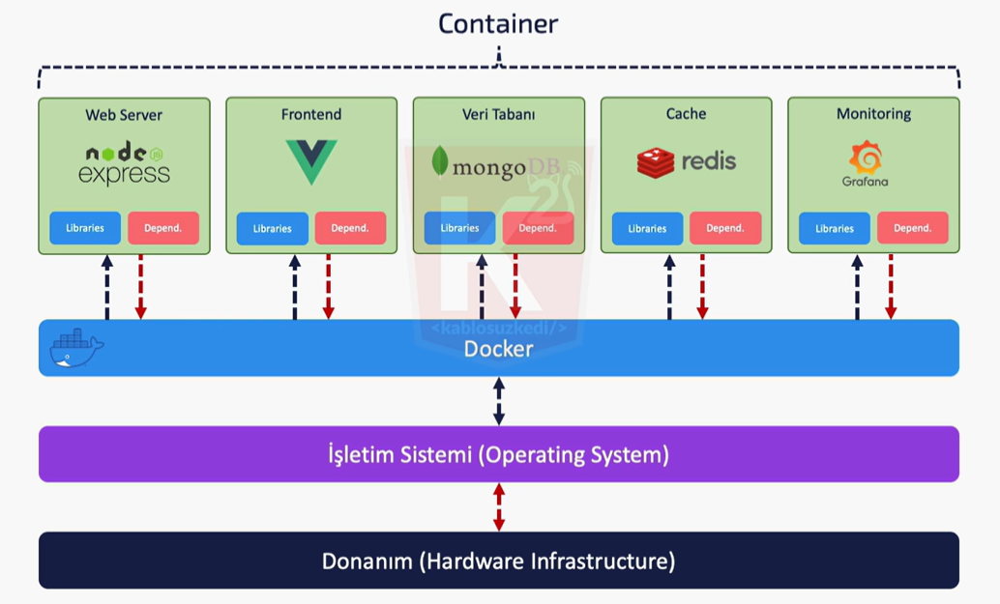
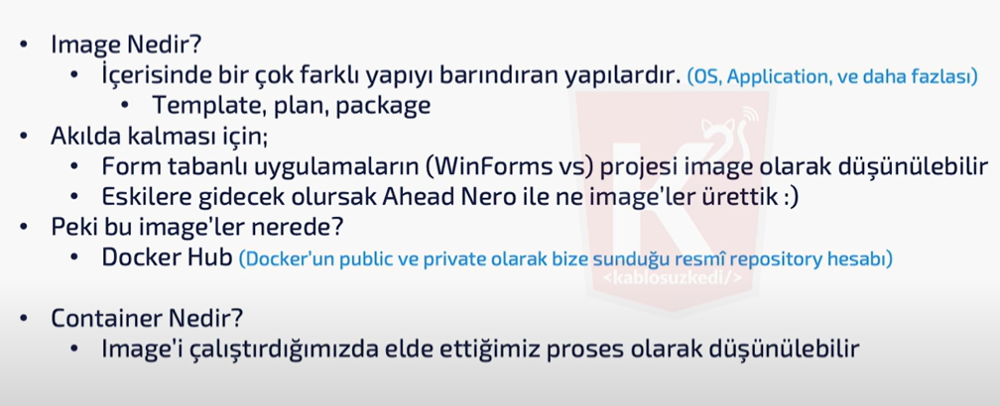
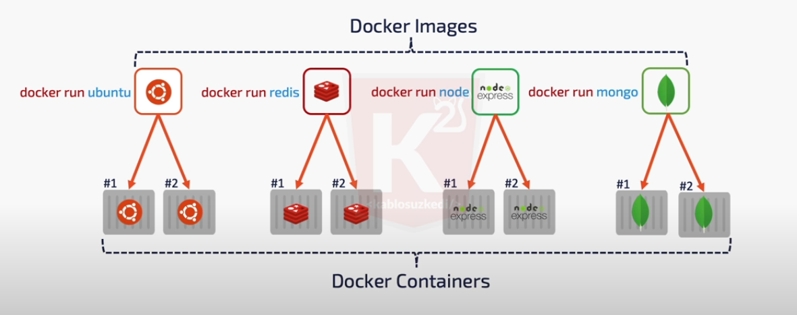
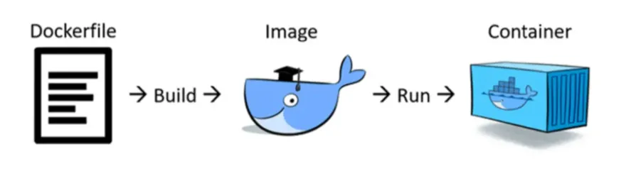

### Docker Kavramlar Nedir ?

**Container yapısı üzerinde sunucu kaldırma işlemleri;**
- Çalıştırılacak kütüphaneler arasında izolasyon sağlar.
- Birden fazla işletim sistemi gereksinimi durumlarından sizi kurtarır.
- Her container içerisinde kendisine ait işlem, servis ve ağa sahiptir. Bu sayede container yapısı ile sunucuda herhangi bir sorunla karşılaştığımızda diğer işlemler çalışırken sadece ilgili bölümü durdurup sorunlu olan bölge üzerinde işlem yapabiliriz. 

- 

<br>

**Container ile vm arasındaki fark;**
- Her vm kendi işletim sistemine sahiptir fakat containerlar tek bir tane işletim sistemine sahiptir. Containerlar sahip olduğu tek işletim sisteminin kernelini paylaşırlar ve birbirilerinden izole bir şekilde çalışırlar.
- Yukarıdaki bilgiyle vm ve container arasında en başta kaynak kullanımı olarak containerın daha işlevli olduğunu söyleyebiliriz.

<br>

**Container ve image kavramları;**



<br><br>

### Docker Komutlar ?

- **DockerHub / Docker Registery**
    - Tıpkı github gibi geliştiriciler açık kaynaklı olarak docker imagelerini yükleyerek ve DockerHub’ta paylaşarak imagelerin bizim de indirip kullanmamıza olanak sağlıyorlar. Kısaca imagelar Docker Registrylerde tutuluyor. *Örneğin siz postgres image’ını kullanmak istiyorsunuz;*

    - **docker pull *postgres/ubuntu/mongo/redis/node***

    - komutu ile indirip artık bu image ile container oluşturabiliyorsunuz. Aslında github’a çok benziyor. Siz de kendiniz imageleri oluşturup yükleyip başkalarının da sizin yarattığınız imageları kullanmalarını sağlayabiliyorsunuz. İsterseniz Private olarak ta registerynizi tutabilirsiniz. Docker bu hizmeti de size sunuyor.

- **docker run *postgres/ubuntu/mongo/redis/node***
    - run komutu ile image in çalıştırılan bir kopyasını oluşturur.
    - tekrar aynı image i run yaptığımızda ikinci bir çalıştırılan kopyası oluşur.

    - 

```c
// bilgisayar üzerinde kurulu tüm imageslar görünür
docker images
// -----------------
// yazılan imageyi proses halinde çalıştırır
docker run "postgres/ubuntu/mongo/redis/node"
// -----------------
// fakat işletim sistemi çalıştırıldığında içine girmek için -it tagı eklenmeli
docker run -it "ubuntu" // it = interaktif terminal
// -----------------
// hangi image çalışıyor bunları listeler
docker ps // ps = process
// -----------------
// geçmişte çalıştırılmış tüm imageler ve sürelerini listeler
docker ps -a // yada "docker ps --all" yada "docker container"
```

```c
// containera isimlendirme yapabiliriyoruz
docker run -it --name bash_ubuntu ubuntu
// isimlendirilmiş containeri arka planda çalıştırmak için
docker start bash_ubuntu // durdurmak için start yerine stop yazmak yeterli
```

Aktif olmayan containerlarda bilgisayarda fiziksel olarak yer kaplıyor. Bunları görmek için **docker ps** yazmak yeterli. Bunları temizlemek için ise;
- **docker rm "containerId/containerName"**

```c
// image i arkaplanda çalıştırmak istiyorsak detach parametresini eklemeliyiz
docker run --detach nginx // "'--detach' yerine '-d' yazılabilir (daha fazla detay için 'docker run --help')"

docker container exec -it nginx bash // exec ne ona bakılacak. ve bash ne alaka
```

### Dockerfile
- Docker'a temel bir image belirtmek için kullanılan metin belgesidir. Kendi özel komutları vardır ve ismi özeldir. **Kendi image imizi oluşturabiliyoruz.**


### Docker Compose

```
docker login --username mucahitcakmak
```
- Giriş yapma hatası alındığında bu şekilde giriş yapılabilir.

### Docker Network

- Docker containerlarının bir sanal makine gibi çalışmasını sağlayan sanal bir network yapısıdr.

- Teorik olarak conteinerlar birbirinden izoledirler fakat conteinerları birbirine bağlayabiliriz. Aynı
network içerisindeymiş gibi birbirleri ile iletişime geçmelerini sağlayabiliriz.


```c
// docker network driver ları:
bridge // containera ip atanmazsa docker tarafından otomatik atanır
none // container ın bir ip e bağlı kalmasını istemiyorsak
host // container ın docker engine ile haberleşmesini sağlar
```

- docker network create network_adı
    - --driver
- docker network inspect network_adı
    - network detaylarını görüntüler. (aynı şekilde 'docker inspect container_id' komutu ile container hakkında da bilgi sahibi olunabilir.)

container ayağa kaldırırken "--network network_adı" parametresini girersek, aynı networke sahip containerlar birbirleri arasında altağ ile bağlanmış olacaktır. nginx yada işletim sistemi üzerinden ping atarak bağlantıyı doğrulayabilir yada docker inspect ile network altında ip adreslerini görebiliriz.

- docker network disconnect network_adı cıkarılmak_istenen_container
    - bu şekilde containerın o networkden kaldırılmasını sağlayabiliriz.